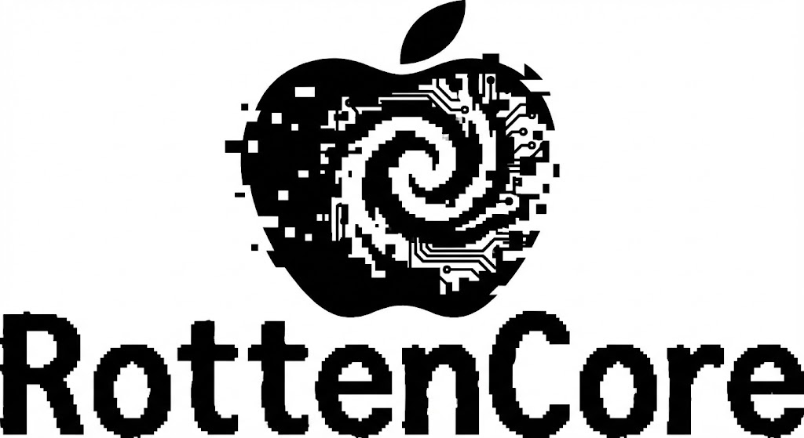

# RottenCore

<p align="center">
  
</p>

RottenCore is a powerful command-line interface (CLI) tool designed to transform conventional videos into stylized "glyph" art animations. This project is an independent effort to create a general-purpose video-to-glyph converter, inspired by existing microcontroller-focused projects. RottenCore compresses video content by converting each frame into a sequence of discrete, small (e.g., 8x8 pixel) graphical blocks (glyphs). This process drastically reduces video data while maintaining a recognizable, albeit "rotten," aesthetic, ideal for low-bandwidth applications, artistic expression, or retro-style displays.

## Functionality

RottenCore provides two primary modes for glyph generation and a robust rendering engine:

1.  **Machine Learning Optimization (`optimize` command):** Utilizes an LPIPS-based neural network to learn the optimal set of 256 (or custom number) glyphs that best represent the video's visual content. This method aims for high perceptual quality but can be computationally intensive.

2.  **Fast K-Means Clustering (`optimize_kmeans` command):** Employs an optimized K-Means algorithm (adapted from existing C implementations and accelerated with Numba) to quickly derive a set of representative glyphs. This mode is significantly faster and suitable for users who prioritize speed or are working with simpler visual content.

3.  **Flexible Rendering (`render` command):** Reconstructs the glyph-based video into standard formats like MP4 or GIF. It supports customizable scaling factors, allowing users to upscale the "rotten" output to higher resolutions while preserving the crisp, pixel-art look.

## Acknowledgements

This project draws inspiration from the innovative work in video compression and glyph-based rendering, particularly from early microcontroller-focused demos like the "Bad Apple!!" implementations. Concepts for data structures and algorithmic approaches were informed by reviewing open-source projects in this domain.

## Installation

Assuming you have obtained the RottenCore project files (e.g., by downloading a release archive or cloning your own fork/repository):

1.  **Navigate to the project directory:**
    ```bash
    cd /path/to/RottenCore
    ```
2.  **Install dependencies:**
    ```bash
    pip install -r requirements.txt
    ```
    Note: The `lpips` library (a dependency for the ML optimization) is installed directly from its GitHub repository via a custom entry in `setup.py`.
3.  **FFmpeg:** Ensure FFmpeg is installed and available in your system's PATH for video processing. This is crucial for video loading and GIF output.
4.  **(Optional) Install as an editable package:**
    If you plan to develop RottenCore or want to use the `rottencore` command directly from your shell, you can install it in "editable" mode:
    ```bash
    pip install -e .
    ```
    This allows you to run `rottencore <command>` from any directory.

## Usage

### Optimize (Train Glyphs with Machine Learning)

To train glyphs for a video using the ML (LPIPS) method:

```bash
python rottencore.py optimize input.mp4 --out project.rc --width 64 --height 48 --epochs 500
```

*   `input.mp4`: Path to your input video file.
*   `--out project.rc`: Output path for the RottenCore project file. This file will contain the trained glyphs and the sequence of glyphs for the input video.
*   `--width`, `--height`: Target resolution for the video frames before glyph extraction.
*   `--glyphs`: Number of glyphs to generate (default: 256).
*   `--block-size`: Size of the square blocks [height width] (default: `8 8`). Example: `--block-size 8 8`.
*   `--epochs`: Number of training epochs (default: 500).
*   `--lr`: Learning rate (default: 0.002).
*   `--batch-size`: Batch size for training (default: 48).
*   `--device`: Device to use for training (`cuda` or `cpu`).

### Optimize K-Means (Fast Glyphs)

To generate glyphs for a video using the faster C-ported K-Means method:

```bash
python rottencore.py optimize_kmeans input.mp4 --out project_kmeans.rc --width 64 --height 48
```

*   `input.mp4`: Path to your input video file.
*   `--out project_kmeans.rc`: Output path for the RottenCore project file.
*   `--width`, `--height`: Target resolution for the video frames before glyph extraction.
*   `--glyphs`: Number of glyphs to generate (default: 256).
*   `--block-size`: Size of the square blocks [height width] (default: `8 8`). Example: `--block-size 8 8`.
*   `--device`: Device to use for K-Means (default: `cpu`). Note that Numba is CPU-bound here.

### Render (Export Video from Project File)

To render a video from a previously generated `.rc` project file:

```bash
python rottencore.py render project.rc --out output.mp4 --scale 4 --fps 30 --gif
```

*   `project.rc`: Path to your RottenCore project file (generated by `optimize` or `optimize_kmeans`).
*   `--out output.mp4`: Output path for the rendered video. The extension determines the output format.
*   `--fps`: Frames per second for the output video. If not specified, it will use the original FPS of the input video that was used to create the project file.
*   `--scale`: Upscaling factor for the output video (e.g., `4` for 4x upscaling, turning a 64x48 video into 256x192). Defaults to `1` (no scaling).
*   `--gif`: If specified, the output video will first be rendered as an MP4, then automatically converted to a high-quality GIF using FFmpeg. Requires FFmpeg to be installed.